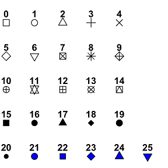

```{r setup, include=FALSE}
knitr::opts_chunk$set(echo = TRUE)
```

# Bonnie's R Reference Guide {.tabset .tabset-pills}


## Loading Data and Packages
### library() and require()
The functions library() and require() load and attach add-on packages.

*   The main argument is the name of a package, given as a name or literal character string, or a character string. 
*   Both functions check and update the list of currently attached packages and do not reload a namespace which is already loaded.
*   The output of these functions will tell you the attached package name and the path to where you can find it in your base folder 

Here's an example of loading the 'here' and 'palmer penguins' packages:

```{r}
library("here")       #attach package 'here'
require("palmerpenguins")     #attach package 'palmer penguins'
```

### here() and read.csv()
The here() function is used to find your project's files, based on your current working directory at the time your package is loaded. 

*   It will always locate the files relative to your project root folder.
*   You can specify path components (subfolders) below the project root if desired, but this is not required
*   Each subfolder component should be a string

The read.csv() function reads the data in as a data frame, and you can assign the data frame to a variable (using <- or =) so that it is stored in R’s memory. read.csv() is often used in conjunction with here() so you can load CSV files directly from your project root folder.

The head() function can also be used to preview the first 6 rows and column headers of the CSV file you loaded in. Let's try that too!
Here's an example:
```{r}
gingko = read.csv(here("data", "gingko.csv"))
head(gingko)
```


## Data Structures
### c()

The function c() combines or concatenates its arguments into a vector (a 1-dimensional data structure consisting of 1 or more elements).

*   All of the elements must be of the same type.
*   I can’t combine character and numeric types in the same call to c()

Here’s two examples using numeric and character data types:
```{r}
## Create a vector of numbers:
num_vec  = c(1, 4, 8, 9, 13)

## Create a vector of characters:
char_vec = c("a", "fish", "data is cool")
```
I can show the contents of a vector by typing the name of the vector, or using the print() function.
```{r}
## Typing the name of the vector into the console prints the contents
num_vec
```
```{r}
## The print() function accomplishes the same task:
print(char_vec)
```

### length()
The length() function can return or set the length of vectors, lists, factors, and any other R object for which a method has been defined.

*    For vectors, lists, and factors the returned length is the total number of elements.
*   You would most often use this function to determine the number of observations or objects in a vector, list or data frame. 
*   Although you may need to worry about removing NA or NULL objects before determining the length.

Here's 3 examples of using length() for a vector, list, and string:

```{r}
#Example 1: Vector
#First we need to create a vector to perform length() on
x = c(9, 12, -6, 4, 78, 19, -64, 101, 103, 2)  # Example vector in R
#Apply length function
length(x)
```
```{r}
#Example 2: List
#Create list
my_list = list("a" = 2.5, "b" = TRUE, "c" = 1:3)
#Get length of list
length(my_list)
```
```{r}
#Example 3: String
#Create example string
my_string <- "Hello this is my string"   
#Get length of string
length(my_string)
```

### matrix()
A matrix is a collection of data elements arranged in a two-dimensional rectangular layout. The matrix() function creates a matrix of rows and columns given a set of values. 

*   The first argument is data, which is a data vector 
*   Nrow and ncol are the next arguments which are the desired number of rows and columns in the matrix
*   byrow is another argument that allows the matrix to be filled with values by row (default is by row but you can set byrow = FALSE to fill by columns)
*   dimnames is an optional argument that allows you to create a list of length 2 to give the row and column names 

Here's an example of how to create a matrix:
```{r}
A = matrix(c(2, 4, 3, 1, 5, 7), nrow=2, ncol=3, byrow=TRUE) 
#Above is the data elements; number of rows and columns; fill matrix by rows 
A         # print the matrix of 2 rows and 3 columns
```

### data.frame()
A data frame is a table or a two-dimensional array-like structure in which each column contains values of one variable and each row contains one set of values from each column. You can create your own data frame through coding in values or you can load in a CSV file to a data frame.

*   The column names should be non-empty.
*   The row names should be unique.
*   The data stored in a data frame can be of numeric, factor or character type.
*   Each column should contain same number of data items

```{r}
#Example of initiating a data frame with coding in data
# Create the data frame
my_df = data.frame(
   df_id = c (1:5), 
   df_name = c("Bonnie", "Sydney", "Roman", "Hunter", "Christian"),
   salary = c(623.3,515.2,611.0,729.0,843.25), 
   start_date = as.Date(c("2012-01-01", "2013-09-23", "2014-11-15", "2014-05-11", "2015-03-27")),
   stringsAsFactors = FALSE)
# Print the data frame	
print(my_df) 
```

```{r}
#Example of reading in a CSV file to a data frame
gingko = read.csv(here("data", "gingko.csv"))
# Print the first 6 lines of the data frame
head(gingko)
```

### nrow(), ncol(), and dim()
Here we will use the gingko data frame we just created above to explore the use of the nrow(), ncol(), and dim() functions in obtaining dimensions.

*   nrow() and ncol() return the number of rows or columns present in a vector, array, or data frame
*   dim() retrieves the set or dimension of an object like a matrix, array, or data frame

Let's test these out:
```{r}
# Retrieve number of rows in gingko data frame
nrow(gingko)
# Retrieve number of columns 
ncol(gingko)
# Retrieve dimensions of gingko data frame
# the result will be presented as row, then column
dim(gingko)
```

## Subsetting
Here we will go over different methods to subsetting, including operators acting on vectors, matrices, arrays and lists to extract or replace parts.

### $
$ is an operator that selects a single element of a list. However, it does not allow computed indices, whereas double square brackets [[  do. To select a specific column in a data frame, you can type in the name of the data frame, followed by the operator, and then the name of the column you are looking to select.

Here is an example using $ to subset and select one of the columns in the gingko data:
```{r}
# Select the maximum width column from the gingko data
# This output will contain a lot of values since the dimensions of the data frame is 756 rows by 6 columns
gingko$max_width
```


### [ ]
Single square brackets [ ] are used to subset by position and select a list of the specified element(s).
However, double square brackets [[ allow you to select a single element of the list by position. 

*   You can select elements using single brackets by row, then column
*   You can use integer values for row and column or use slicing to select multiple rows and columns

Here is how to select the first row of the gingko data:
```{r}
# Select only the first row of the gingko data
# With not specifying columns, the results will show us the first row values for all columns
gingko[1,]
```
Now we will select the element in row 2, column 3:
```{r}
# Specify to only extract the value in row 2, and of column 3
gingko[2,3]
```
Finally, we will use square brackets to select the 3rd column of the ginkgo data:
```{r}
# Select the whole 3rd column from gingko
gingko[,3]
```

### subset()
The subset() function returns a subsets of vectors, matrices or data frames which meet certain conditions input as arguments.

*   You must first specify the data frame from which you are subsetting, then specify the conditions to subset with
*   You can use the relational operator == to select only specific columns of a data frame
*   You can also use the operator != to specify NOT to select a certain column or columns in a subset.

Here we will use this function to retrieve all the data for Adelie penguins (in the species column) from the penguins dataset.
```{r}
require(palmerpenguins) # first we need to load the palmer penguins package
peng = subset(penguins, species == "Adelie")  # perform subset of only Adelie
head(peng)  # lets view the first 6 rows of the data to see the subset
```


## Numerical Data Exploration

### summary()

The summary() function computes summary statistics of data and model objects.

*   The main argument is just the data you wish to run summary statistics on
*   Common applications of the summary function include computing summary statistics on vectors, data frames, and statistical models
*   Output of the summary function will include descriptive statistics such as minimum, quantiles, median, mean, and maximum values of our input data

Here we will compute summary statistics on our gingko dataset:
```{r}
# Summary on gingko dataset
summary(gingko)                # Run summary statistics on gingko
```


### mean()
The mean is calculated by taking the sum of the values in a dataset and then  dividing it by the total number of values in that data series.

The function mean() is used to calculate this in R. The input data argument should be either numeric or logical.


*   The main argument is just the data you wish to perform the mean function on (could be whole vector, matrix or data frame OR a subset of those objects)
*   If there are missing values, then the mean function returns NA
*   To drop the missing values from the calculation use na.rm = TRUE which means remove the NA values
*   You can also use the trim argument to drop certain values from the data when calculating the mean

Here we will demonstrate the use of the mean() function on the gingko dataset:
```{r}
# Perform mean on gingko column max_width
mean(gingko$max_width)    # use subsetting to get mean of column
```


### sd()

The sd() function computes the standard deviation of a numeric input vector. Standard deviation is a measure of the amount of variation or dispersion of a set of data values. The formula for standard deviation is the square root of the sum of squared differences from the mean divided by the size of the data set.

*   The sd() function is pretty simple like the mean() function, as the main argument is just the data - the only issue you may run into with real data is NA or missing values
*   Again, you can set the na.omit equal to TRUE to remove any missing values in the data

Here we will use the gingko data again to demonstrate the sd() function:
```{r}
# Perform standard deviation function on gingko maximum leaf depth column
sd(gingko$max_depth)  # use subsetting to select the column you want
```


## Graphical Data Exploration

### plot()
In R, the plot() function is a very commonly used and a generic function, meaning, it has many methods which are called according to the type of object passed to it. In the simplest case, we can pass in a single vector and we will get a scatter plot of magnitude vs index. More often we pass in two vectors or two columns of a data frame and a scatter plot of these points are plotted.

Here we will create a scatterplot of gingko max leaf depth (x) and max leaf width (y). There are many different arguments you can pass to the plot function in order to change the plot characteristics. Here are some example arguments:

**col =** changes the color of the points or line plotted either by color name or number. You can also use .rgb() to enter specific levels of red, green, and blue hues. You can see all colors by running the code : colors()    (Example: col = "steelblue")

**pch =** This is the graphical argument used to specify point shapes. You specify point type by setting pch = to the desired point type number. See examples of point types below:



**cex =** is an argument you can optionally pass a number to indicating the amount by which plotting text and symbols should be scaled relative to the default. 1=default, 1.5 is 50% larger, 0.5 is 50% smaller, etc. It can often be useful to make your point size bigger in your plot. (Example: cex = 1.5)

**main =** is an argument you can use to add a main title to your plot. You set main = to the string text you would like to describe your plot overall. (Example: main = "This is my title text") By default, this text will appear centered at the top of your plot.

**xlab =** allows you to write a proper label for your x-axis based on the data you are plotting. For example, you can specify the column of data you are plotting on the x-axis and the units (Example: xlab = "X axis column (units)").

**ylab =** allows you to write a proper label for your y-axis based on the data you are plotting. For example, you can specify the column of data you are plotting on the y-axis and the units (Example: ylab = "Y axis column (units)").

**xlim =** is used to set the lower and upper limit on the x-axis. Use the c() function to concatenate the lower and upper limit you desire and pass this to the xlim = argument. (Example: xlim = c(0,10))

**ylim =** is used to set the lower and upper limit on the y-axis. Use the c() function to concatenate the lower and upper limit you desire and pass this to the ylim = argument. (Example: ylim = c(100,200))

Let's show an example of calling the plot function using the above arguments.
```{r}
#call the plot function with x, y as data columns via subsetting
plot(gingko$max_depth, gingko$max_width,
     main = "Gingko trees: maximum leaf depth vs. maximum leaf width",
     xlab = "Maximum leaf depth (mm)",
     ylab = "Maximum leaf width (mm)",
     col = "purple",
     pch = 16,
     cex = 1.5,
     xlim = c(0,160),
     ylim = c(0,140)) 
```


### hist()
The hist() function in R is used to create histograms of your data, or in other words, an approximate representation of the distribution of numerical data. The main argument is just the data you would like to plot the frequency and dispersion of. You can also pass various arguments like col, xlim, ylim, main, xlab, ylab to hist() like discussed above in the plot() tutorial. 

**breaks =** is a new argument, not used with plot(), which you can pass to the hist() function in order to specify how the bins of the histogram are broken up and how many there should be. Breaks can be specfied several ways:

*   a vector giving the breakpoints between histogram cells
*   a function to compute the vector of breakpoints
*   a single number giving the number of cells for the histogram
*   a character string naming an algorithm to compute the number of cells (see ‘Details’)
*   a function to compute the number of cells

Here, we will create a histogram of penguin flipper lengths using the palmer penguins dataset and specify the number of bins using breaks.
```{r}
hist(penguins$flipper_length_mm, 
     main = "Histogram of Penguin Flipper Length",
     xlab = "flipper length (mm)",
     breaks = 11,
     xlim = c(160,250))
```


Now, we will create a 4-panel figure of histograms using the penguin data, in a 2 by 2 grid. 

**par()** and **mrow = ** can be used to create multi-panel plots. You can specify the number of rows and columns as well. (Example: par(mfrow= c(1,2)) for a 1 row, 2 column figure)
```{r}
# Establish the multi-panel figure; 2 by 2
par(mfrow= c(2,2))
hist(penguins$body_mass_g, 
     main = "Histogram of Penguin Body Mass",
     xlab = "body mass (g)")
hist(penguins$bill_length_mm, 
     main = "Histogram of Penguin Bill Length",
     xlab = "bill length (mm)")
hist(penguins$bill_depth_mm, 
     main = "Histogram of Penguin Bill Depth",
     xlab = "bill depth (mm)")
hist(penguins$flipper_length_mm, 
     main = "Histogram of Penguin Flipper Length",
     xlab = "flipper length (mm)")
```


### boxplot()
Boxplot() function is a method for graphically depicting groups of numerical data through their quartiles. Box plots may also have lines extending from the boxes indicating variability outside the upper and lower quartiles. The main argument is just the data subset you would like to show the quartiles for. Again, you can also specify titles and axes labels using main, xlab, ylab. 

The central bold line indicates the median value of the data. Box limits indicate the range of the central 50% of the data. Lines extend from each box to capture the range of the remaining data, with dots placed past the line edges to indicate outliers.

A **conditional** box plot partitions the data of a numeric column into classes according to another nominal column and creates a box plot for each of the classes.

Here we will demonstrate two examples:

1.    a simple boxplot of ginkgo petiole lengths
2.    a conditional boxplot of one of the continuous variables conditioned on the seeds_present column.

```{r}
# Simple boxplot of petiole lengths
boxplot(gingko$petiole_length,
        main = "Boxplot of Gingko Petiole Lengths",
        ylab = "petiole length (mm)")
```
```{r}
# Conditional boxplot of max leaf width conditioned on seeds present column
boxplot(gingko$max_width ~ gingko$seeds_present,
        ylab = "Gingko Maximum Leaf Width (mm)", 
        xlab = "", 
        main = "Boxplot of Gingko Maximum Leaf Width conditioned on seeds present",
        names = c("No Seeds Present", "Seeds Present"))
#use names = to specify the values of the seeds present column (instead of TRUE and FALSE)
```


## Distribution Functions

### The Normal Distribution
Here we will cover the density function, distribution function, and quantile function for the normal distribution where mean is equal to mean and standard deviation is equal to sd. The normal distribution is a continuous probability distribution where the values lie in a symmetrical fashion (shaped like a bell-curve) mostly situated around the mean.

*   If mean or sd are not specified they assume the default values of 0 and 1, respectively.

**dnorm()** is the density function for the normal distribution. Also known as the probability density function (PDF). The total area under any normal density curve is always equal to one.

Let’s find the value of the normal distribution PDF at x=10 with a mean=20 and a sd=5.
```{r}
# the required arguments are x (the data/value), mean, and standard deviation
# in this case, the output is just a single probability
dt1 <- dnorm(x=10, mean=20, sd=5)
dt1

#we can also plot a whole PDF given a set of data values
x = seq(-3, 3, length = 200)
y = dnorm(x, mean = 0, sd = 1)
plot(x, y, type = "l", main = "Normal Distribution Probability Density Function")
x = seq(-3, 0, length = 100)
y = dnorm(x, mean = 0, sd = 1)
polygon(c(-3, x, 0), c(0, y, 0), col = "blue")
# since the total area under a normal PDF curve is equal to 1, the shaded blue area should be = 0.5
```


**pnorm()** is the distribution function for the normal distribution. Pnorm() returns the value of the cumulative density function (CDF) of the normal distribution. The result is the probability that the variable X takes a value lower or equal to x. Given arguments include a certain value q, a mean, and a standard deviation value.

The argument lower.tail = can be used with pnorm(). If it is = TRUE (default), probabilities are P[X ≤ x] otherwise, P[X > x]. Basically, the default is that pnorm() will calculate values of the CDF LESS THAN the x you input. If you set lower.tail = FALSE, then the cumulative probability of GREATER THAN x will be calculated. You could also use the law of total probability equaling to 1.

Assuming the data follow a symmetric normal distribution, we can demonstrate with an example calculating the percentage of otters that weight less than 33 lbs in a population with mean = 40 and sd = 8:
```{r}
# CDF of normal dist. less than certain value
# percentage of otters that weight less than 33 lbs (just multiply by 100)
a = pnorm(33, mean=40, sd = 8)
a
# CDF of normal dist, but greater than certain value
# percentage of otters that weight greater than 33 lbs (just multiply by 100)
b = pnorm(33, mean=40, sd = 8, lower.tail = FALSE)
b
# a and b should add up to 1, so let's check:
a + b

# You could also check the probability of an otter weighing between 33 and 40 lbs.
pnorm(40, mean=40, sd=8) - pnorm(33, mean=40, sd=8)
```

**qnorm()** is the quantile function for the normal distribution. The qnorm function allows you to find the quantile (percentile) for any probability. Hence, the qnorm function is the inverse of the pnorm function. Given an area, with qnorm you can find the boundary value that determines this area.

P is the argument you plug your desired percentile into, followed by mean and standard deviation, and lower.tail if needed. Qnorm() deals by default with areas below the given boundary value. If you want to change this, set lower.tail = FALSE.

For example, suppose you want to find the 85th percentile of our otter data normal distribution whose mean is 40 and whose standard deviation is 8. Then you ask for:
```{r}
# 85th percentile of otter weights given same mean and sd
qnorm(0.85,mean=40,sd=8)

# since we know the standard normal distribution has mean = 0 and sd = 1, we can check that the 97.5% and 2.5% percentiles are at about the +/- 1.96 values
qnorm(0.975,mean=0,sd=1)
qnorm(0.025,mean=0,sd=1)
```

### The Binomial Distribution
Again, this will cover the probability density function, cumulative distribution function, and quantile function but for the binomial distribution with parameters size and prob. This is conventionally interpreted as the number of ‘successes’ in *size* number of trials.

The binomial distribution is a discrete distribution that counts the number of successes in a certain number of Bernoulli experiments or trials. A Bernoulli process is the repetition of a random experiment (a Bernoulli trial) where each independent observation is classified as success if the event occurs or failure if it does not occur. 

Size is an argument (integer > 0 only) representing the number of Bernoulli trials, and prob is an argument representing the probability of success on each trial. You will also need to pass a main argument of x,q, or p to the following functions representing your desired data/value.

**dbinom()** is the Binomial probability mass function (Probability function).

*   Main arguments required are x, size, and prob.

In order to calculate the binomial probability function for a set of values (x), a number of trials (size) and a probability of success (prob) are needed. Let's see an example where you want to calculate the binomial probability mass function for x = 1:10 with a probability of succcess in each trial of 0.2:
```{r}
# binomial probability function for a set of values
dbinom(x = 1:10, size = 10, prob = 0.2)

# we can also plot an example of the dbinom
# Grid of X-axis values
x <- 1:80

# we can also see how the probability function changes with various probabilities given
# size = 80, prob = 0.3
plot(dbinom(x, size = 80, prob = 0.2), type = "h", lwd = 2,
     main = "Binomial probability function",
     ylab = "P(X = x)", xlab = "Number of successes")

lines(dbinom(x, size = 80, prob = 0.3), type = "h",
      lwd = 2, col = rgb(1,0,0, 0.7))

# size = 80, prob = 0.4
lines(dbinom(x, size = 80, prob = 0.4), type = "h",
      lwd = 2, col = rgb(0, 1, 0, 0.7))

# Add a legend
legend("topright", legend = c("80  0.2", "80  0.3", "80  0.4"),
       title = "size  prob", title.adj = 0.95,
       lty = 1, col = 1:3, lwd = 2, box.lty = 0)
```


**pbinom()** is the Binomial distribution (Cumulative distribution function).
Pbinom() can be used to calculate the probability of a variable X (which follows a binomial distribution) taking on values lower than or equal to another specified value x.

*   The main arguments again include q, a quantile or vector of quantiles, size, which is the number of trials (n > = 0), and prob,the probability of success on each trial
*   lower.tail can also be used: By default it is = TRUE, and probabilities are P(X <= x), otherwise if set = FALSE then P(X > x) 

We can demonstrate with the probability of success occurring less than 3 times if the number of trials is 10 and the probability of success is 0.3:
```{r}
# use pbinom to get cumulative distribution function 
# find probability of success occuring less than 3 times
pbinom(3, size = 10, prob = 0.3)
```
Here's another example of pbinom, using a real world scenario. Consider that a basketball player typically scores 4 out of 10 baskets (p = 0.4). If the player thows 20 baskets in total (20 trials), then what is the probability of them scoring 6 or less baskets in a game?
```{r}
# prob of scoring 6 or less baskets
pbinom(6, size = 20, prob = 0.4)  #0.25 or approx 25%

#prob of scoring 6 or more baskets
pbinom(6, size = 20, prob = 0.4, lower.tail = FALSE)  #0.75 or approx 75%

# you could also calculate the probability of scoring between 7 and 11 baskets
pbinom(11, size = 20, prob = 0.4) - pbinom(7, size = 20, prob = 0.4) # approx 53%
```


**qbinom()** gives the quantile or percentile function for the binomial distribution. Given a probability or a set of probabilities, the qbinom function allows you to obtain the corresponding binomial quantile.

*   The main arguments include p, a probability or vector of probabilities, size, which is the number of trials (n > = 0), and prob,the probability of success on each trial
*   lower.tail can also be used: By default it is = TRUE, and probabilities are P(X <= x), otherwise if set = FALSE then P(X > x) 

As an example, we can see the binomial quantile for the probability of p=0.4 if size = 5 and p = 0.7:
```{r}
# quantile function for probability of 0.4 given 5 trials and prob success = 0.7
qbinom(p = 0.4, size = 5, prob = 0.7)   # 3
```


